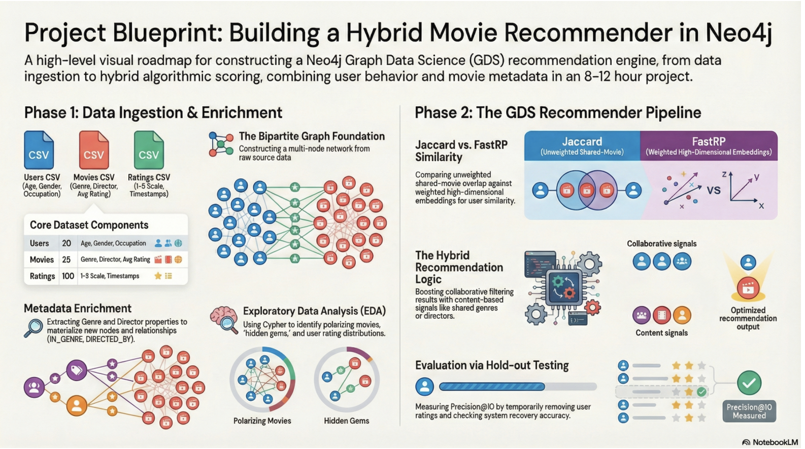

# Hybrid Movie Recommender System in Neo4j

Most recommender systems treat movies as isolated items. This project treats them as nodes in a graph — connected to genres, directors, and users — and uses those connections to generate recommendations that go beyond "people who watched X also watched Y."

Built with Neo4j and the Graph Data Science (GDS) library, the system combines three recommendation signals into a single hybrid scoring engine and evaluates results against held-out ratings.

---



---

## The Problem

Collaborative filtering alone struggles with two real-world issues:

- **Sparsity** — most users have only rated a small fraction of available movies, leaving large gaps in the similarity matrix
- **The long-tail problem** — popularity-biased systems keep surfacing the same well-known films while high-quality, low-exposure movies go unnoticed

A graph-native approach addresses both: Genre and Director nodes act as bridges between users who have never co-rated the same movie, and content-based signals can surface hidden gems that collaborative filtering would miss.

---

## Graph Schema

```
(User)-[:RATED {rating: 1-5}]->(Movie)
(Movie)-[:IN_GENRE]->(Genre)
(Movie)-[:DIRECTED_BY]->(Director)
(User)-[:SIMILAR_TASTE {score}]->(User)   ← written by Jaccard algorithm
(User)-[:KNN_SIMILAR {score}]->(User)     ← written by FastRP + kNN
```

Genre and Director are modelled as first-class nodes rather than string properties on Movie. This allows the GDS algorithms to propagate preference signals through structural paths like:

```
User → Movie → Genre → Movie → User
User → Movie → Director → Movie → User
```

---

## Recommendation Pipeline

```
Raw Ratings
    │
    ▼
Graph Enrichment
(Genre + Director nodes extracted from Movie properties)
    │
    ├──► Jaccard Node Similarity
    │    (co-rated movie overlap → SIMILAR_TASTE edges)
    │
    ├──► FastRP Embeddings → kNN Cosine Similarity
    │    (structural neighborhood → KNN_SIMILAR edges)
    │
    └──► Hybrid Scorer
         collaborative signal
         + genre overlap bonus
         + director affinity bonus (scaled)
              │
              ▼
         Ranked Recommendations
              │
              ▼
         Hold-out Evaluation (Precision@K)
```

---

## Algorithms Used

| Algorithm | Purpose | Library |
|-----------|---------|---------|
| Jaccard Node Similarity | Collaborative filtering via co-rated movie overlap | Neo4j GDS |
| FastRP Node Embeddings | Structural embeddings capturing multi-hop genre/director paths | Neo4j GDS |
| kNN (cosine similarity) | User-to-user similarity on FastRP embeddings | Neo4j GDS |
| Louvain Community Detection | Taste cluster discovery for community-level analysis | Neo4j GDS |
| Hybrid Scoring | Weighted combination of collaborative + content signals | Custom Cypher |

---

## Tech Stack

- **Neo4j Desktop** — graph database
- **Neo4j GDS Library v2.x** — Jaccard, FastRP, kNN, Louvain
- **Cypher** — all graph queries written natively
- **Python + Jupyter** — notebook orchestration and evaluation
- **Neo4j Python Driver** — used in extension exercises for reproducibility

---

## Dataset

- 20 users, 25 movies, 100 ratings (~20% density)
- Custom dataset designed to test the recommender logic
- CSV files: `data/movies.csv`, `data/users.csv`, `data/ratings.csv`

**Honest note on scale:** This is a proof-of-concept dataset. The small size means evaluation metrics (Precision@K on a 2-movie hold-out) are directional rather than statistically conclusive. The architecture is designed to scale — see Future Work below.

---

## Key Results

- Jaccard and kNN-cosine independently converged on the same top recommendations for test users, validating the hybrid's top picks through algorithm agreement
- Hybrid scoring surfaced additional genre-coherent titles that neither collaborative method found alone
- Louvain community detection produced clusters that aligned with intuitive genre-based taste profiles
- Long-tail analysis identified high-quality films (avg rating ≥ 4.0) in the bottom quartile of exposure — demonstrating the content signal's ability to surface hidden gems

---

## Repo Structure

```
├── README.md
├── notebook/
│   └── hybrid_recommender.ipynb       ← main notebook
├── data/
│   ├── movies.csv
│   ├── users.csv
│   └── ratings.csv
└── architecture/
    └── graph_schema.md                ← schema and pipeline diagram
```

---

## How to Read This Notebook

The notebook is a **documented walkthrough** — Cypher queries were executed directly in Neo4j Desktop and results are captured as screenshots inline. It is not designed to be re-run cell by cell.

To explore the graph yourself:
1. Install **Neo4j Desktop** and enable the **Graph Data Science plugin**
2. Place the CSV files from the `data/` folder into your Neo4j `import/` directory
3. Copy the Cypher queries from the notebook cells and run them in your own Neo4j instance

---

## Future Work

- **Scale to MovieLens 1M/25M** — validate that the hybrid scoring logic holds under real-world sparsity and user volume
- **k-fold cross-validation** — replace the single hold-out test with proper cross-validated Precision@K and NDCG across all users
- **Link prediction pipeline** — frame recommendation as a graph link prediction problem using the GDS native pipeline for more rigorous evaluation
- **Temporal weighting** — decay older ratings so recent preferences carry more signal
- **Implicit feedback** — incorporate viewing duration or search history alongside explicit star ratings
- **Normalized hybrid scoring** — min-max normalize the hybrid score back to the 1–5 rating scale for more interpretable output

---

## Author

Arnold Muzarurwi
